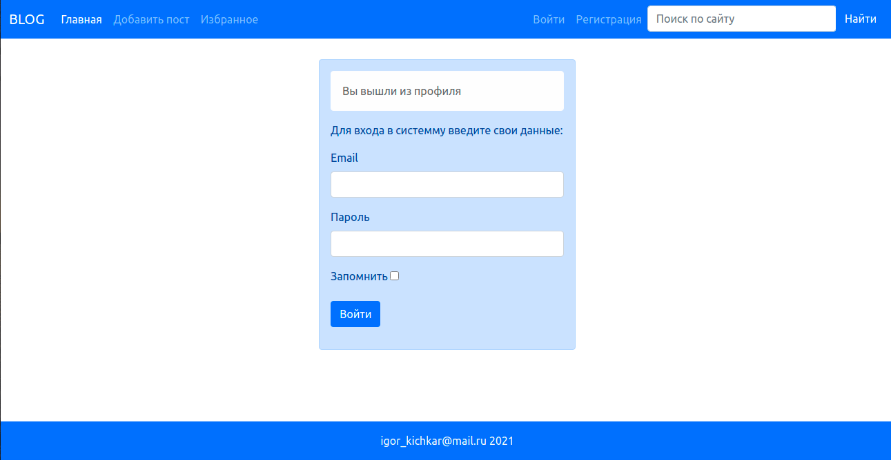
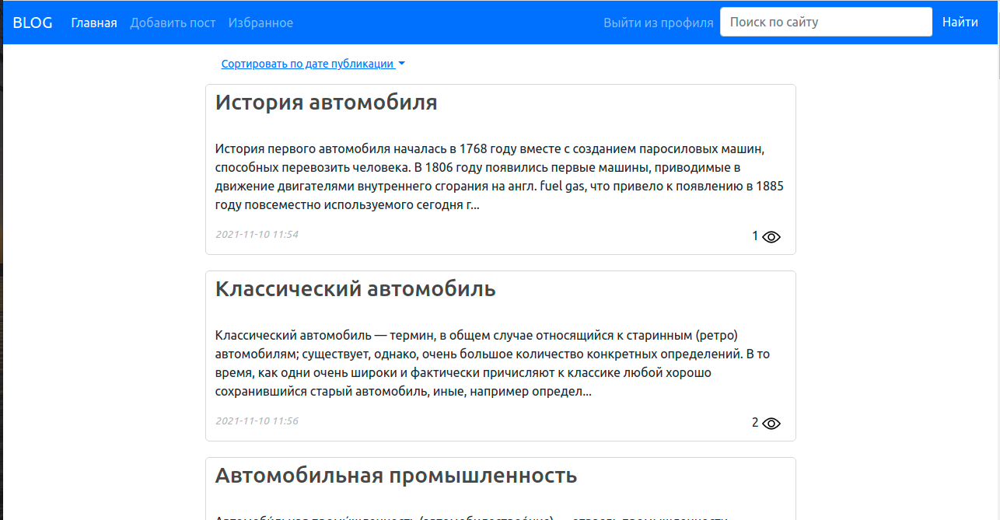
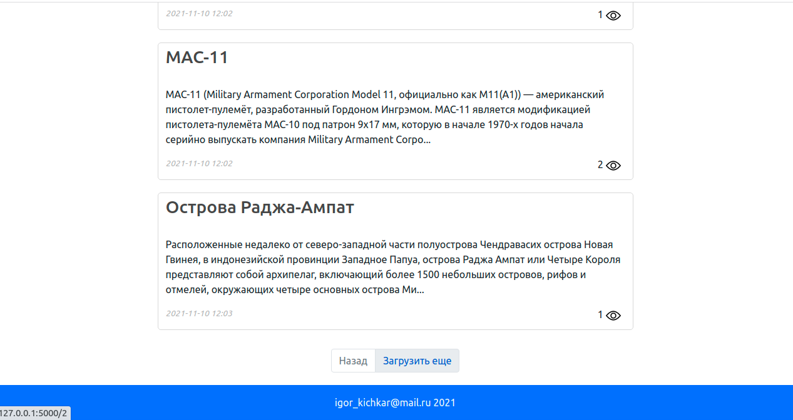
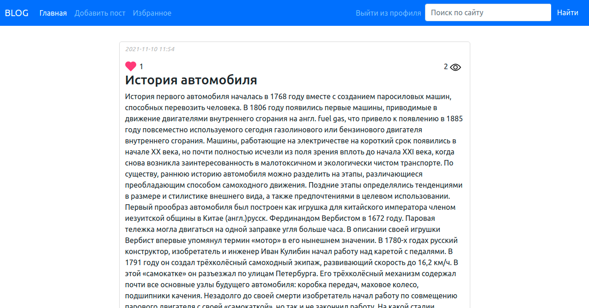
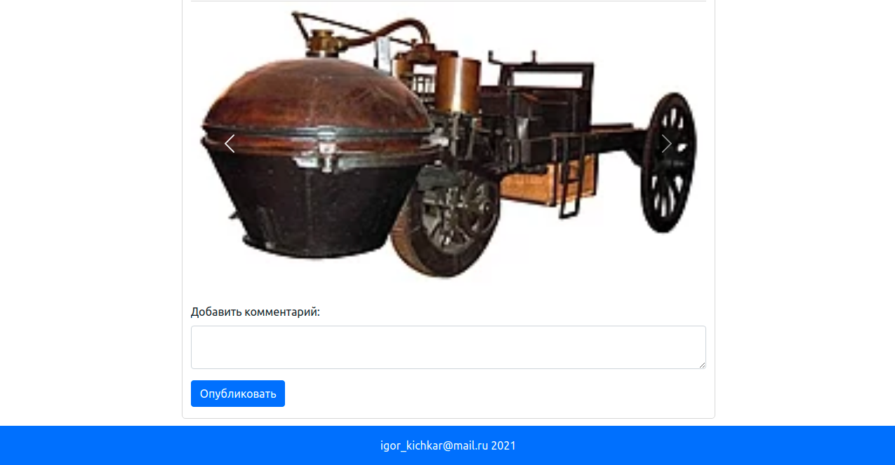
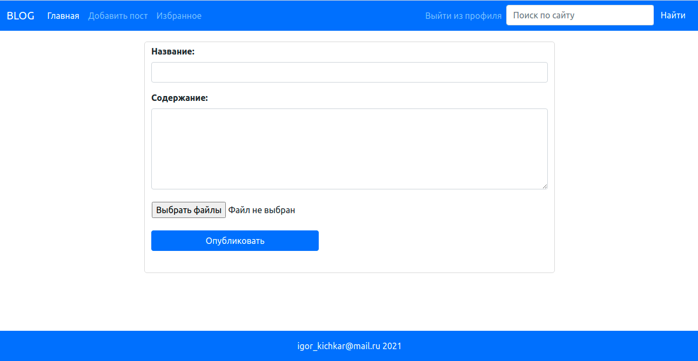
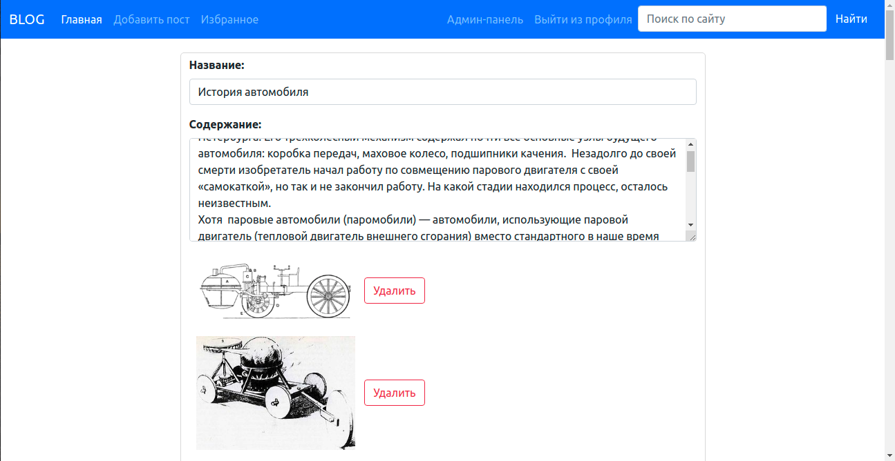
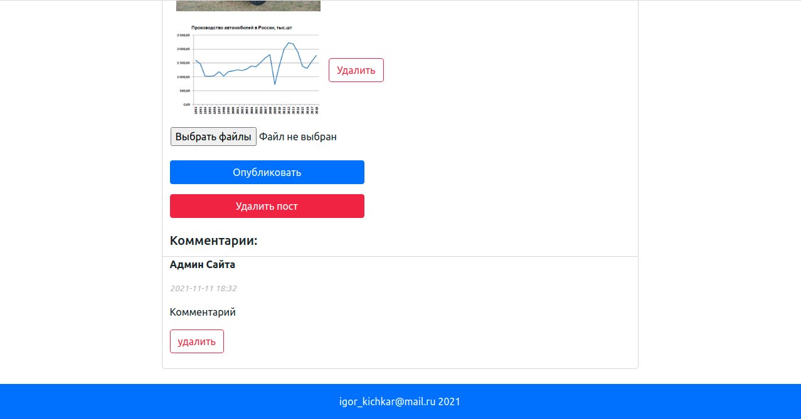
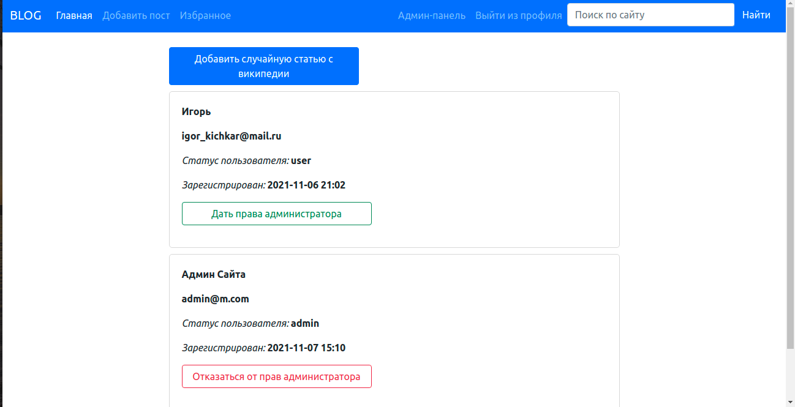

<h2 align="center">Avto-blog</h2>.
The project was created based on the Flask framework.

###Users can:
- Register on the site.
- Add post (with pictures). 
- Edit, delete posts (only own).
- Add comments.
- Add posts to favorites.
- Search posts using the search bar.
- Sort posts by date added

###The administrator can:
- Edit, delete any post.
- Delete comments.
- Give administrator rights to another user.
- Add a random article from Wikipedia.

###The site supports:
- Page pagination
- Pageview counter
- Favorites counter

###When creating a blog, the following were used:
-Flask framework
-Sqlite database
-SQLAlchemy ORM
-Flask-WTF for creating forms on pages.
-BeautifulSoup - parser for adding random posts from Wikipedia

###To get administrator rights enter 
login: admin@m.com 
password: 1

Screenshots:

