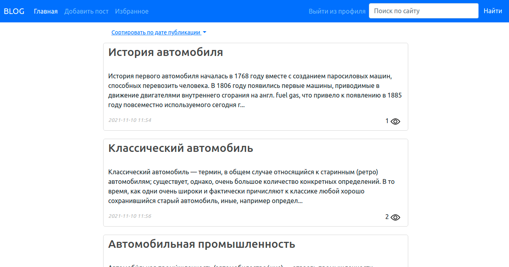
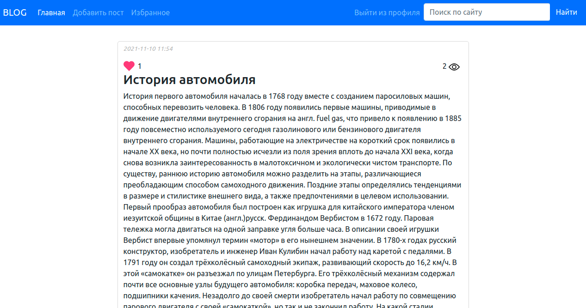
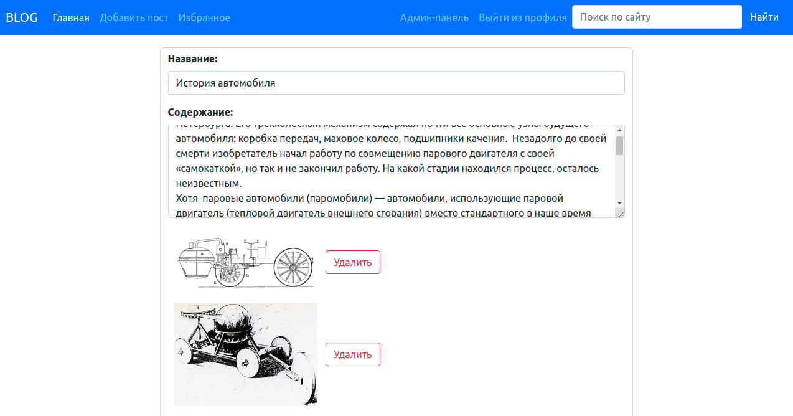
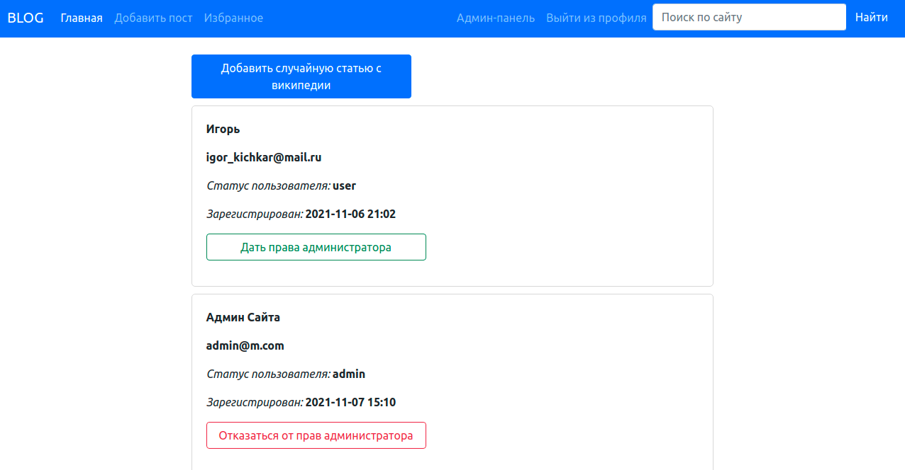

<h1 align="center">Avto-blog</h1>.
<h2>The project was created based on the Flask framework.</h2>

### Users can:
- Register on the site.
- Add post (with pictures). 
- Edit, delete posts (only own).
- Add comments.
- Add posts to favorites.
- Search posts using the search bar.
- Sort posts by date added

### The administrator can:
- Edit, delete any post.
- Delete comments.
- Give administrator rights to another user.
- Add a random article from Wikipedia.

### The site supports:
- Page pagination
- Pageview counter
- Favorites counter

### When creating a avto-blog, the following were used:
- Flask framework
- Sqlite database
- SQLAlchemy ORM
- Flask-WTF.
- Flask_login
- BeautifulSoup.

### To start the server, you need to:
- Clone the repository avto-blog.
- Set the virtual environment in the project folder
```
python3 -m venv .venv
```
- Activate virtual environment
```
source .venv/bin/activate
```
- Install requirements
```
pip3 install -r requirements.txt
```
- Start the server
```
python3 app.py
```

### To get administrator rights:
<p><b>Login:</b> admin@m.com</p> 
<p><b>Password:</b> 1</p>

### Screenshots:
<p align="center">

</p>
<p align="center">

</p>
<p align="center">

</p>
<p align="center">

</p>
<p align="center">

</p>
<p align="center">

</p>
<p align="center">

</p>
<p align="center">

</p>
<p align="center">

</p>
